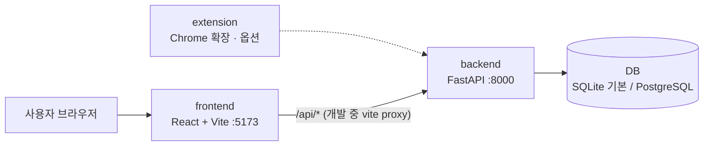
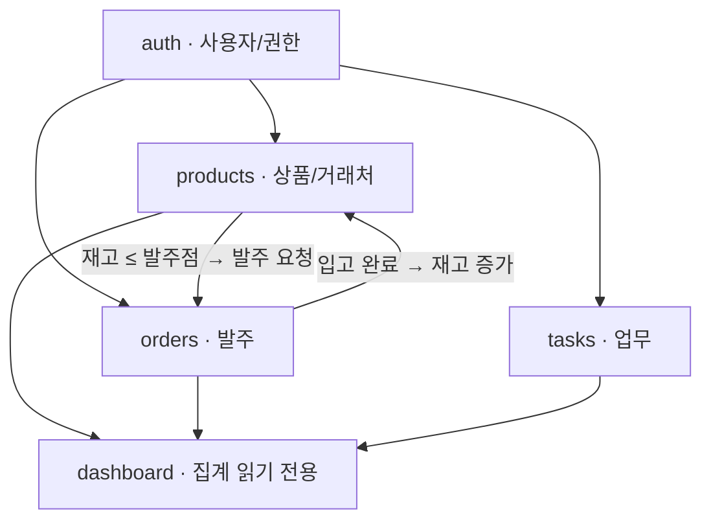

# 시스템 구조

## 전체 구성



- 프론트엔드는 화면만 담당하고, 데이터는 전부 `/api/*` REST API로 주고받습니다.
- 개발 중에는 Vite가 `/api` 요청을 `localhost:8000`으로 전달(proxy)하므로, 프론트 코드에서는 서버 주소를 쓰지 않고 `/api/...`만 씁니다.
- DB는 기본값이 SQLite 파일(`backend/erp.db`)이라 설치 없이 실행됩니다. 배포할 때나 PostgreSQL로 개발하고 싶을 때는 `DATABASE_URL`만 바꾸면 됩니다.

## 모듈 구성

기획 문서(`docs/planning/`)의 탭 하나가 모듈 하나입니다. 프론트와 백엔드가 **같은 이름**으로 폴더를 나눕니다.

| 우선순위 | 모듈 | 담당 | 백엔드 | 프론트엔드 | API |
|:---:|---|---|---|---|---|
| 1 | 로그인·공통 | 미정 | `app/modules/auth` | `src/features/auth`, `src/app`, `src/shared` | `/api/auth/*` |
| 2 | 상품 관리 | 조윤빈 | `app/modules/products` | `src/features/products` | `/api/products` |
| 3 | 주문 관리 | 강경원 | `app/modules/orders` | `src/features/orders` | `/api/orders` |
| 4 | 업무 관리 | 미정 | `app/modules/tasks` | `src/features/tasks` | `/api/tasks` |
| 5 | 대시보드 | 미정 | `app/modules/dashboard` | `src/features/dashboard` | `/api/dashboard/*` |
| 옵션 | 상품 소싱 (크롬 확장) | 미정 | — | `extension/` | 기존 API 사용 |

모듈 사이의 관계:



- **dashboard**는 다른 모듈의 테이블을 읽기만 합니다. 자기 테이블이 없습니다.
- **products ↔ orders**가 가장 강하게 연결됩니다. 두 담당자가 `Product`, `Order` 모델을 바꿀 때는 서로 미리 알려 주세요.

## 폴더 구조

```
erp/
├─ backend/                     FastAPI 서버
│  ├─ app/
│  │  ├─ main.py                앱 생성, /api 라우터 등록, CORS
│  │  ├─ models.py              모든 모델 import (Alembic 용)
│  │  ├─ core/
│  │  │  ├─ config.py           .env 설정 (DATABASE_URL 등)
│  │  │  └─ database.py         DB 연결, Base, TimestampMixin, str_enum, get_db
│  │  └─ modules/<모듈>/
│  │     ├─ models.py           SQLAlchemy 테이블
│  │     ├─ schemas.py          Pydantic 요청/응답 형식
│  │     └─ router.py           API 엔드포인트
│  ├─ alembic/                  DB 마이그레이션
│  ├─ tests/                    pytest (메모리 DB 사용)
│  └─ pyproject.toml            의존성 (uv)
├─ frontend/                    React + Vite + TypeScript
│  └─ src/
│     ├─ main.tsx               진입점
│     ├─ app/                   router.tsx(라우트), AppLayout.tsx(사이드바)
│     ├─ shared/                api/client.ts, hooks/useApi.ts, components/
│     └─ features/<모듈>/       types.ts(API 응답 타입) + 화면 컴포넌트
├─ extension/                   (옵션) Chrome 확장
├─ docs/
│  ├─ architecture.md           이 문서
│  ├─ erd.md                    DB 설계 초안
│  ├─ conventions.md            브랜치·커밋·PR 규칙
│  └─ planning/                 Notion 기획 원본
├─ .github/                     CI, PR·이슈 템플릿
└─ docker-compose.yml           (선택) PostgreSQL
```

## 새 기능을 추가하는 순서 (예: 거래처 목록 API + 화면)

1. **백엔드 모델**: `modules/<모듈>/models.py`에 테이블 추가 → 새 모듈이면 `app/models.py`에 import 추가
2. **마이그레이션**: `uv run alembic revision --autogenerate -m "add xxx"` → 생성된 파일 확인 → `uv run alembic upgrade head`
3. **스키마·라우터**: `schemas.py`에 요청/응답 형식, `router.py`에 엔드포인트. 새 모듈이면 `main.py`에 라우터 등록
4. **테스트**: `tests/`에 API 테스트 추가 → `uv run pytest`
5. **프론트 타입**: `features/<모듈>/types.ts`에 응답 타입을 백엔드 스키마와 똑같이 작성
6. **화면**: `features/<모듈>/`에 페이지 → 새 페이지면 `app/router.tsx`와 `AppLayout.tsx`의 `NAV_ITEMS`에 등록

API 문서는 백엔드를 실행한 뒤 http://localhost:8000/docs 에서 볼 수 있습니다.
