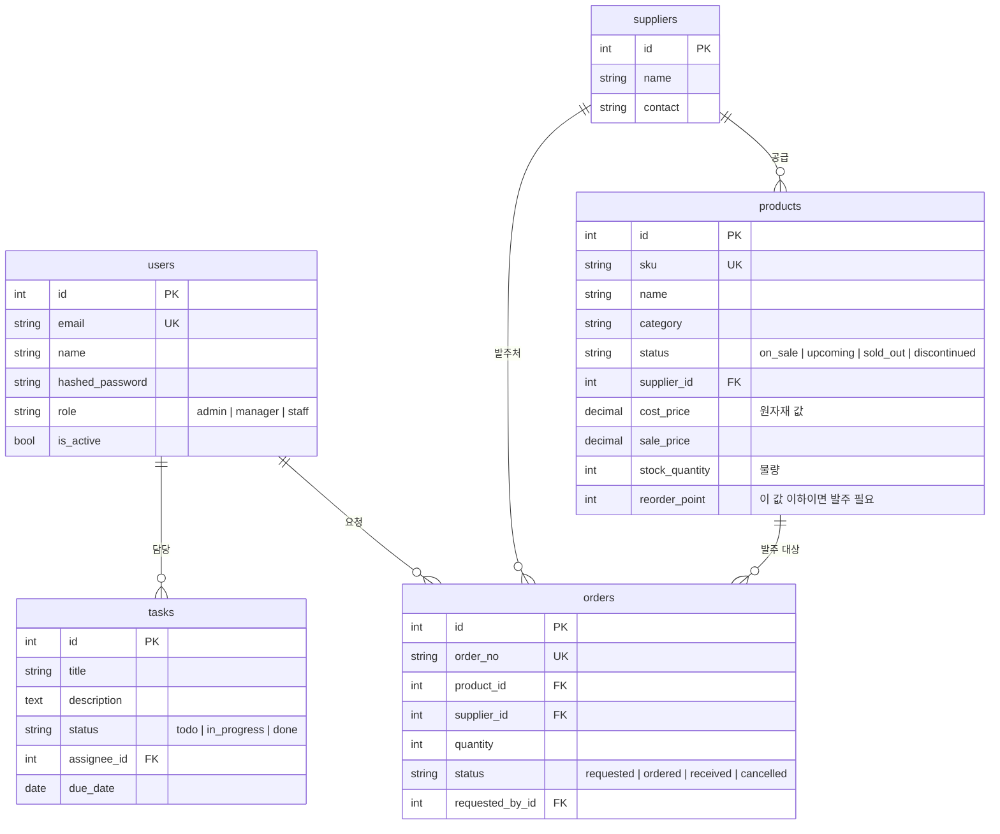

# DB 설계 (ERD 초안)

`docs/planning/강경윤반.md`의 "3.2 DB Schema(ERD)"에 해당하는 초안입니다. 지금 뼈대 코드(`backend/app/modules/*/models.py`)와 같은 내용입니다.
**확정된 설계가 아닙니다.** 기획이 구체화되면 이 문서와 모델을 함께 고쳐 주세요.

모든 테이블에는 `created_at`, `updated_at`이 자동으로 들어갑니다(`TimestampMixin`).

## 기획 문서에서 가져온 근거

| 컬럼/테이블 | 근거 (`docs/planning/`) |
|---|---|
| `products.status` 4가지 | Product Management — "품절된거, 단종된거, 판매예정, 판매중" |
| `products.supplier_id`, `suppliers` | Product Management — "어디에서 주문하는지" |
| `products.cost_price` | Product Management — "원자재 값" |
| `products.stock_quantity`, `reorder_point` | Product Management — "물량", "주문해야 한다는 정보를 주는 곳" |
| `users.role` | Dashboard 최종 — "DB USER 별 권한 부여" |

## 결정이 필요한 것

- [ ] **판매처(쿠팡, 에이블리 등)와 판매량**: `sales_channels` 테이블과 `product_channels`(상품별 판매처·판매량) 연결 테이블이 필요해 보입니다.
- [ ] **"판매자 유형"이 필요한지** (Product Management의 열린 질문)
- [ ] **Order Management의 범위**: 거래처에 넣는 발주(매입)만 다룰지, 고객 판매 주문까지 다룰지. 지금 `orders`는 발주로 설계되어 있습니다.
- [ ] **자주 나가는 상품 자동 발주**: `products`에 `auto_reorder` 플래그를 둘지, 규칙 테이블을 따로 둘지
- [ ] **권한 범위**: 역할(role)별로 어떤 화면과 기능을 허용할지
